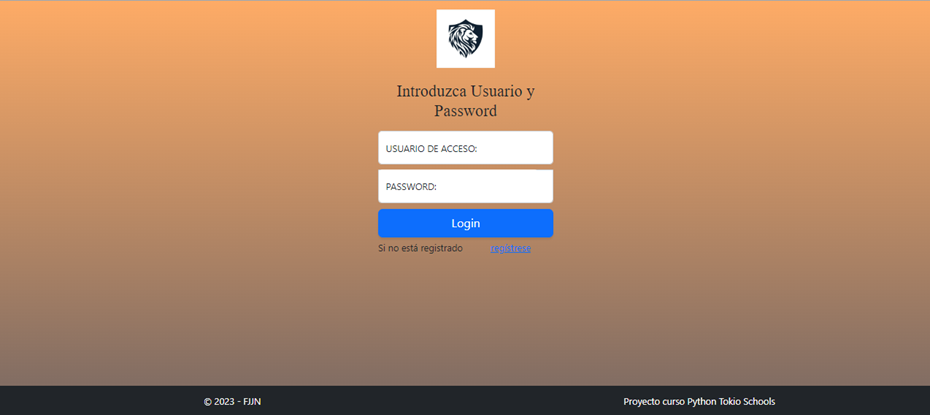

# TOKIO SCHOOLS - CURSO PYTHON
## PROYECTO FIN DE CURSO DE PROGRAMACIÓN  PYTHON

### INTRODUCCIÓN

Se nos pide como desarrolladores, crear una aplicación web con Python para una empresa de suministros informáticos. Esta aplicación debe cumplir con algunos requisitos:
1.	Nos piden tener inventariado todos sus productos y cuáles son sus cantidades en el almacén, de tal forma, que cuando el stock esté al 90% nos avise de pedir al proveedor. 
2.	En la aplicación web sería ideal tener dos tipos de acceso, uno para clientes y otro para nosotros, un usuario administrador que tenga acceso a todo.
3.	Necesitaremos para nuestros clientes unas gráficas de ventas. Para nosotros, tendremos unas gráficas comparativas, para saber lo que vendemos y los beneficios que sacamos de nuestros proveedores. También se podrá buscar una alternativa para las gráficas, calculando unas estadísticas de ventas y compras y mostrando dichos resultados.
4.	Todos los productos deben tener una descripción del producto, así como lo que hay en el almacén, su precio, lugar donde se encuentra, etc. Aquí podéis tomaros licencias sobre la información extra que añadir, como número de referencia, colores…
5.	Para los proveedores, debemos tener almacenados todos los datos de contacto (nombre de empresa, teléfono, dirección, cif…), facturación, precios de sus productos, porcentaje de descuento, IVA, etc.
6.	Debemos elaborar la aplicación web de la forma más sencilla para el usuario y lo más práctica para nosotros en su manejo y obtención de datos importante para la empresa. Hay que tener en cuenta la Experiencia del Usuario la cual se caracteriza por sencillez, claridad, intuición. 

###	STACK TECNOLÓGICO
Lenguaje de programación: Python

FrameWork: Flask – Motor de templates: Jinja2

Base de datos: Sqlite3

Lenguaje de acceso a BBDD: Sqlalchemy (ORM)

### INSTALACIÓN
#### 1.-	Copia de ficheros
Copiaremos todos los ficheros que se han proporcionado en un directorio.
#### 2.-	Descarga e Instalación de Python
La versión de Python utilizada en el proyecto ha sido la 3.10.7, por lo que le sugerimos que instale dicha versión. Para ello puede acceder a www.python.org y descargarse la versión 3.10.7 o bien descárguela desde la siguiente url :
	https://www.python.org/ftp/python/3.10.7/python-3.10.7-amd64.exe
Una vez descargado el fichero hacer doble clic para ejecutarlo

#### 3.-	Instalación y activación del entorno virtual
Desde cmd, nos situaremos en el directorio donde hemos guardado los ficheros de la aplicacion.
Escribiremos lo siguiente para instalar el entorno virtual “pip install virtualenv” y podremos observar que comienza su instalación
A continuación, escribiremos “virtualenv venv”
En este momento ya está instalado el entorno virtual, ahora debemos activarlo, y para ello escribimos “cd venv\Scripts”
y a continuación “activate”
 	
#### 4.-	Instalación de los requerimientos del software
Para instalar los requerimientos del software, tendremos que volver al directorio donde tenemos los ficheros de la aplicación:

Y una vez allí teclear “pip install -r requirements.txt”
 
### EJECUCIÓN DE LA APLICACIÓN
#### 1.-	Inicialización de la BBDD
Lo primero que debemos hacer es inicializar la Base de Datos, para ello ejecutaremos la siguiente instrucción: “python initBD.py”
 
Este proceso, crea la base de datos y nos proporcionará un usuario inicial para acceder a la aplicación.
		USUARIO: ADMIN
		PASSWORD: ADMIN

#### 2.-	Ejecutando la aplicación
Para ejecutar la aplicación teclearemos “python main.py”
 
Como podemos observar, la aplicación estará ejecutándose en http://127.0.0.1:5000. Al acceder a esta dirección obtendremos la pantalla principal de la aplicación.
En esta pantalla acceda con el usuario y contraseña indicados anteriormente. 

